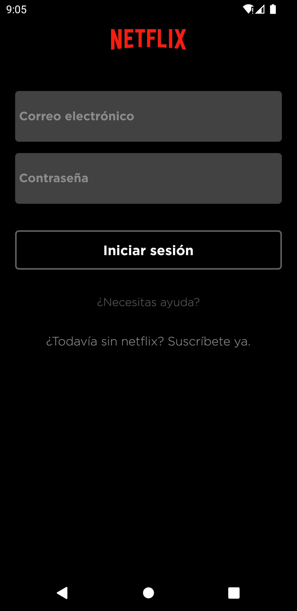
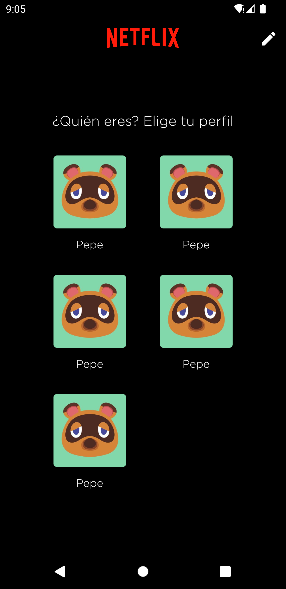
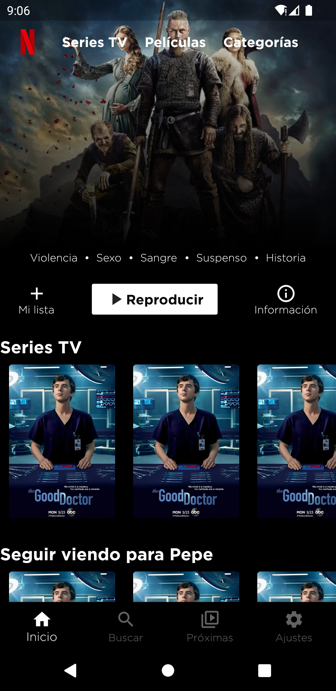
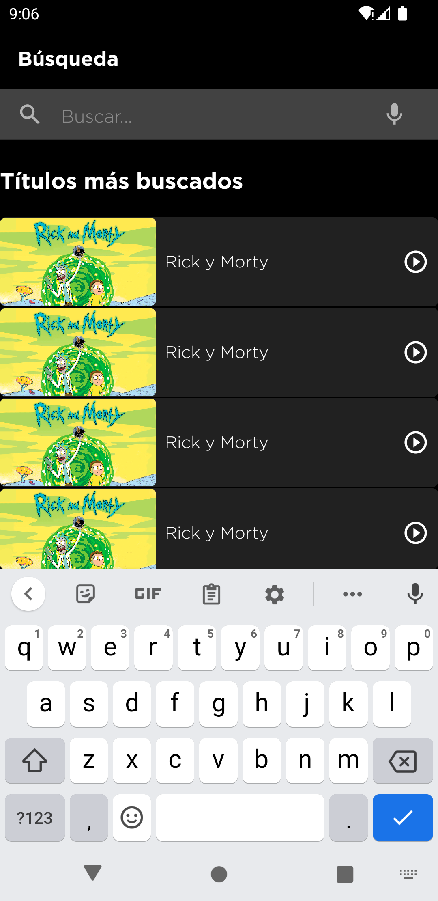
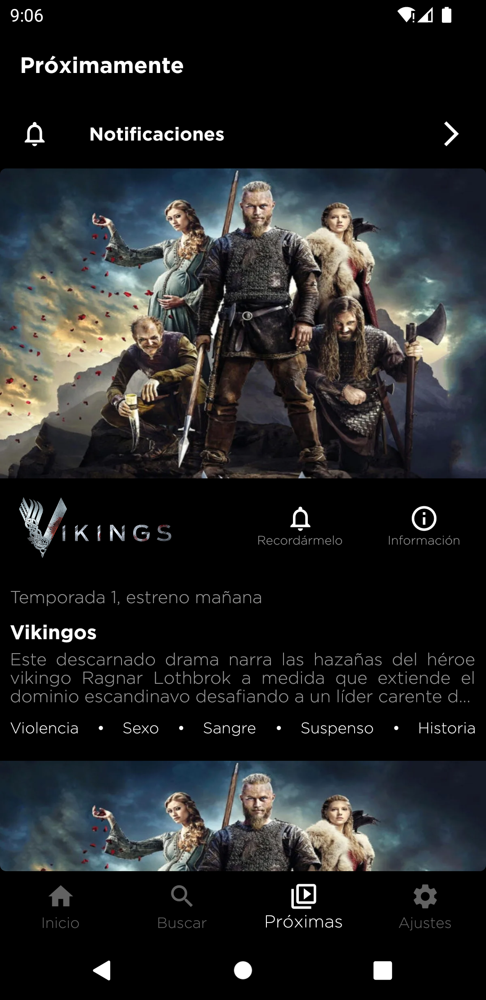
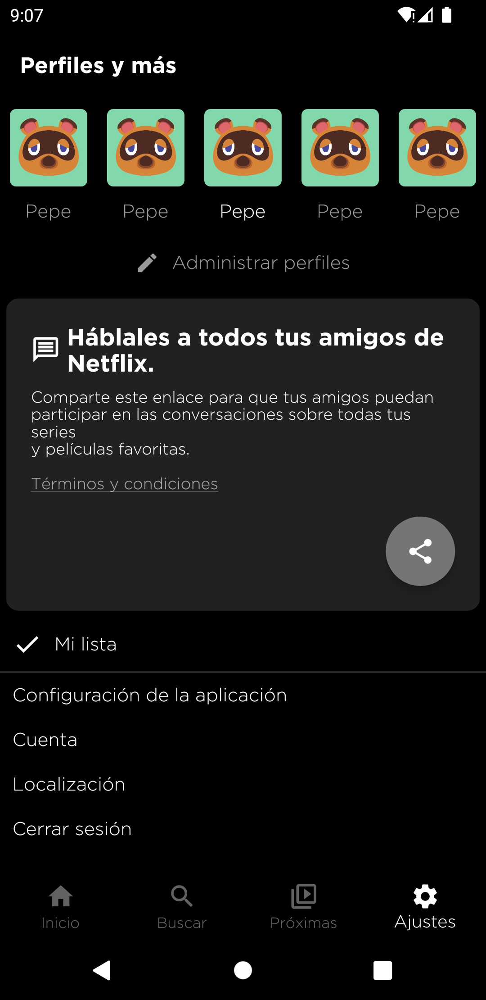

# netflix_propio

### Proyecto en el que he intentado copiar el diseño de Netflix, cambiando ciertos detalles a mi propio estilo y conocimientos.

Es una app la cual la única funcionalidad que tiene es de navegación, compartir y google maps, ya que solo estoy intentando replicar el diseño, no el funcionamiento propio de la app.
Aún no es responsive.

**Si deseas ver su funcionamiento en yotube:**
📹: https://youtu.be/tz7JPGna4HI

**Si prefieres ver capturas de la app:**

### Página de login

### Página elección de perfil

### Página de inicio

  

### Página de búsqueda

### Página de próximas

### Página de ajustes

### Función de botón de compartir

### Función API Google Maps

